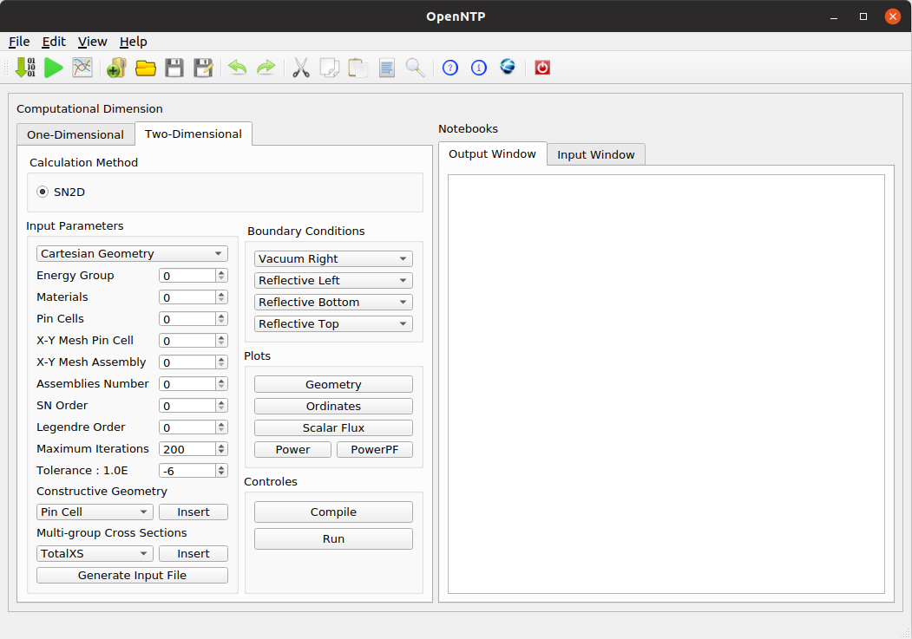

User's Guide
============

Graphical User Interface
************************

A graphical user interface written in Python programing language has been developed to simplify the use of package OpenRSN.
After starting the software by typing the following command line in a terminal:

    .. code-block:: python

         cd OpenRSN
         $ python3 main.py

A main window (GUI) of the package OpenRSN on an Ubuntu Linux machine will be displayed as in Figure bellow.

Creating JSON Input File
************************

The input data file must be in JSON format. The first method is
to write it directly in Text editor as is shown in the figure bellow, which illustrates an example input file of a simplified nuclear reactor with a quarter  of the x,y square 2D core taken from `[Filho et al.,2002]. <https://doi.org/10.1016/S0168-9274(01)00074-5>`_

    .. code-block:: json
 
        {
          "data": {
            "parameter": {
              "id": 100,
              "Total number of energy groups": 1,
              "Total number of Materials": 4,
              "Total number of X regions": 4,
              "Total number of Y regions": 4,
              "X region thickness per [cm]": [35, 10, 20, 40],
              "Y region thickness per [cm]": [35, 10, 20, 40],
              "Which material goes in each cell":[[4, 4, 4, 4],
                                                  [3, 3, 3, 4],
                                                  [2, 2, 3, 4],
                                                  [1, 2, 3, 4]],
              "XY number of fine meshes in each cell":[[2, 2, 2, 2],
                                                       [2, 2, 2, 2],
                                                       [2, 2, 2, 2],
                                                       [2, 2, 2, 2]],
              "Number of Angular Discretization": 8,
              "The l-order Legendre polonomial": 0,
              "Maximum Iteration": 200,
              "Epsilon Keff": 1.0e-8
            },
            "materials": [
              {
                "id": 1,
                "nom": "a",
                "XSTotal": [0.222589],
                "XSNuFission": [0.00283283],
                "XSScatter Matrix":[[0.220563]],
                "XSChi":  [1.0]
              },
              {
                "id": 2,
                "nom": "b",
                "XSTotal": [0.216566],
                "XSNuFission": [0.0104347],
                "XSScatter Matrix":[[0.210697]],
                "XSChi":  [1.0]
              },
              {
                "id": 3,
                "nom": "c",
                "XSTotal": [0.301439],
                "XSNuFission": [0.000513036],
                "XSScatter Matrix":[[0.296069]],
                "XSChi":  [1.0]
              },
              {
                "id": 4,
                "nom": "d",
                "XSTotal": [0.252250],
                "XSNuFission": [0.0],
                "XSScatter Matrix":[[0.250794]],
                "XSChi":  [0.0]
              }
            ]
          }
        }

Generating JSON Input File
**************************

Another method is to use a set of buttons on the left side of the main
window [ref], these buttons allow users to insert input data automatically without requiring an in-depth knowledge of JSON file syntax. Once the user clicks on Data Up button the input JSON file will be automatically generated in the window Text editor .

.. image:: _images/insert.png 

