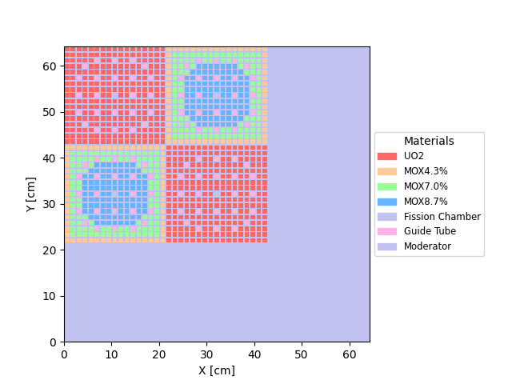
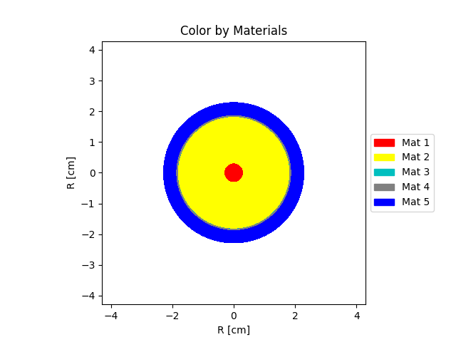

User's Guide
============
========================
1. Graphical User Interface
========================

A graphical user interface written in Python programing language has been developed to simplify the use of package OpenNTP.
After starting the software by typing the following command line in a terminal:

    .. code-block:: python

         cd OpenNTP
         $ python main.py

A main window (GUI) of the package OpenNTP on an Ubuntu Linux machine will be displayed as in Figure bellow.

.. image:: _images/main.png 

========================
2. Examples & test suite
========================

-----------------------------
2.2. Two-dimensional benchmark
-----------------------------

2.2.1. Creating JSON Input File
-----------------------------

The input data file must be in JSON format. The first method is
to write it directly in **Text editor**  as is shown in the figure below, which illustrates an example input file of a C5G7 benchmark on deterministic transport calculations without spatial homogenization taken from `[Lewis, E. E., et al.,2001]. <https://doi.org/10.1016/j.pnueene.2004.09.003>`_

    .. code-block:: json

        {
          "data": {
            "parameter": {
              "id": 100,
              "Total number of energy groups": 7,
              "Total number of materials": 7,
              "Total number of pin cells": 7,
              "Total number of assemblies": 3,
              "Core":[[3,3,3],
                      [2,1,3],
                      [1,2,3]],
              "Number of angular discretizations": 4,
              "The l-order Legendre polynomial": 0,
              "Maximum number of iterations": 200,
              "Criterion of Keff convergence": 1.0e-6
            },
            "Assemblies": [
              {
                "id": 1,
                "nom": "UO2",
                "assembly": [[1,1,1,1,1,1,1,1,1,1,1,1,1,1,1,1,1], 
                             [1,1,1,1,1,1,1,1,1,1,1,1,1,1,1,1,1], 
                             [1,1,1,1,1,6,1,1,6,1,1,6,1,1,1,1,1], 
                             [1,1,1,6,1,1,1,1,1,1,1,1,1,6,1,1,1], 
                             [1,1,1,1,1,1,1,1,1,1,1,1,1,1,1,1,1], 
                             [1,1,6,1,1,6,1,1,6,1,1,6,1,1,6,1,1], 
                             [1,1,1,1,1,1,1,1,1,1,1,1,1,1,1,1,1], 
                             [1,1,1,1,1,1,1,1,1,1,1,1,1,1,1,1,1], 
                             [1,1,6,1,1,6,1,1,5,1,1,6,1,1,6,1,1], 
                             [1,1,1,1,1,1,1,1,1,1,1,1,1,1,1,1,1], 
                             [1,1,1,1,1,1,1,1,1,1,1,1,1,1,1,1,1], 
                             [1,1,6,1,1,6,1,1,6,1,1,6,1,1,6,1,1], 
                             [1,1,1,1,1,1,1,1,1,1,1,1,1,1,1,1,1], 
                             [1,1,1,6,1,1,1,1,1,1,1,1,1,6,1,1,1], 
                             [1,1,1,1,1,6,1,1,6,1,1,6,1,1,1,1,1], 
                             [1,1,1,1,1,1,1,1,1,1,1,1,1,1,1,1,1], 
                             [1,1,1,1,1,1,1,1,1,1,1,1,1,1,1,1,1]]
              },
              {
                "id": 2,
                "nom": "MOX",
                "assembly": [[2,2,2,2,2,2,2,2,2,2,2,2,2,2,2,2,2],
                             [2,3,3,3,3,3,3,3,3,3,3,3,3,3,3,3,2],
                             [2,3,3,3,3,6,3,3,6,3,3,6,3,3,3,3,2],
                             [2,3,3,6,3,4,4,4,4,4,4,4,3,6,3,3,2],
                             [2,3,3,3,4,4,4,4,4,4,4,4,4,3,3,3,2],
                             [2,3,6,4,4,6,4,4,6,4,4,6,4,4,6,3,2],
                             [2,3,3,4,4,4,4,4,4,4,4,4,4,4,3,3,2],
                             [2,3,3,4,4,4,4,4,4,4,4,4,4,4,3,3,2],
                             [2,3,6,4,4,6,4,4,5,4,4,6,4,4,6,3,2],
                             [2,3,3,4,4,4,4,4,4,4,4,4,4,4,3,3,2],
                             [2,3,3,4,4,4,4,4,4,4,4,4,4,4,3,3,2],
                             [2,3,6,4,4,6,4,4,6,4,4,6,4,4,6,3,2],
                             [2,3,3,3,4,4,4,4,4,4,4,4,4,3,3,3,2],
                             [2,3,3,6,3,4,4,4,4,4,4,4,3,6,3,3,2],
                             [2,3,3,3,3,6,3,3,6,3,3,6,3,3,3,3,2],
                             [2,3,3,3,3,3,3,3,3,3,3,3,3,3,3,3,2],
                             [2,2,2,2,2,2,2,2,2,2,2,2,2,2,2,2,2]]
              },
              {
                "id": 3,
                "nom": "Moderator",
                "assembly": [[7,7,7,7,7,7,7,7,7,7,7,7,7,7,7,7,7],
                             [7,7,7,7,7,7,7,7,7,7,7,7,7,7,7,7,7],
                             [7,7,7,7,7,7,7,7,7,7,7,7,7,7,7,7,7],
                             [7,7,7,7,7,7,7,7,7,7,7,7,7,7,7,7,7],
                             [7,7,7,7,7,7,7,7,7,7,7,7,7,7,7,7,7],
                             [7,7,7,7,7,7,7,7,7,7,7,7,7,7,7,7,7],
                             [7,7,7,7,7,7,7,7,7,7,7,7,7,7,7,7,7],
                             [7,7,7,7,7,7,7,7,7,7,7,7,7,7,7,7,7],
                             [7,7,7,7,7,7,7,7,7,7,7,7,7,7,7,7,7],
                             [7,7,7,7,7,7,7,7,7,7,7,7,7,7,7,7,7],
                             [7,7,7,7,7,7,7,7,7,7,7,7,7,7,7,7,7],
                             [7,7,7,7,7,7,7,7,7,7,7,7,7,7,7,7,7],
                             [7,7,7,7,7,7,7,7,7,7,7,7,7,7,7,7,7],
                             [7,7,7,7,7,7,7,7,7,7,7,7,7,7,7,7,7],
                             [7,7,7,7,7,7,7,7,7,7,7,7,7,7,7,7,7],
                             [7,7,7,7,7,7,7,7,7,7,7,7,7,7,7,7,7],
                             [7,7,7,7,7,7,7,7,7,7,7,7,7,7,7,7,7]]
              }
        ],
            "PinCells": [
              {
                "id": 1,
                "nom": "UO2",
                "width_x":[0.15144,0.95712,0.15144],
                "width_y":[0.15144,0.95712,0.15144],
                "mat_fill": [[7,7,7],
                             [7,1,7],
                             [7,7,7]],
                "fine_mesh": [[1,1,1],
                              [1,1,1],
                              [1,1,1]]
              },
              {
                "id": 2,
                "nom": "MOX4.3%",
                "width_x":[0.15144,0.95712,0.15144],
                "width_y":[0.15144,0.95712,0.15144],
                "mat_fill": [[7,7,7],
                             [7,2,7],
                             [7,7,7]],
                "fine_mesh": [[1,1,1],
                              [1,1,1],
                              [1,1,1]]
              },
              {
                "id": 3,
                "nom": "MOX7.0%",
                "width_x":[0.15144,0.95712,0.15144],
                "width_y":[0.15144,0.95712,0.15144],
                "mat_fill": [[7,7,7],
                             [7,3,7],
                             [7,7,7]],
                "fine_mesh": [[1,1,1],
                              [1,1,1],
                              [1,1,1]]
              },
              {
                "id": 4,
                "nom": "MOX8.7%",
                "width_x":[0.15144,0.95712,0.15144],
                "width_y":[0.15144,0.95712,0.15144],
                "mat_fill": [[7,7,7],
                             [7,4,7],
                             [7,7,7]],
                "fine_mesh": [[1,1,1],
                              [1,1,1],
                              [1,1,1]]
              },
              {
                "id": 5,
                "nom": "Fission Chamber",
                "width_x":[0.15144,0.95712,0.15144],
                "width_y":[0.15144,0.95712,0.15144],
                "mat_fill": [[7,7,7],
                             [7,5,7],
                             [7,7,7]],
                "fine_mesh": [[1,1,1],
                              [1,1,1],
                              [1,1,1]]
              },
              {
                "id": 6,
                "nom": "Guide Tube",
                "width_x":[0.15144,0.95712,0.15144],
                "width_y":[0.15144,0.95712,0.15144],
                "mat_fill": [[7,7,7],
                             [7,6,7],
                             [7,7,7]],
                "fine_mesh": [[1,1,1],
                              [1,1,1],
                              [1,1,1]]
              },
              {
                "id": 7,
                "nom": "Moderator",
                "width_x":[0.15144,0.95712,0.15144],
                "width_y":[0.15144,0.95712,0.15144],
                "mat_fill": [[7,7,7],
                             [7,7,7],
                             [7,7,7]],
                "fine_mesh": [[1,1,1],
                              [1,1,1],
                              [1,1,1]]
              }
        ],
            "materials": [
              {
                "id": 1,
                "nom": "UO2",
                "XSTotal":
        [1.77949E-01,3.29805E-01,4.80388E-01,5.54367E-01,3.11801E-01,3.95168E-01,5.64406E-01],
                "XSNuFission":
        [2.00599E-02,2.02730E-03,1.57059E-02,4.51830E-02,4.33421E-02,2.02090E-01,5.25711E-01],
                "XSFission":
        [7.21206E-03,8.19301E-04,6.45320E-03,1.85648E-02,1.78084E-02,8.30348E-02,2.16004E-01],
                "XSScatter Matrix":
        [[[1.27537E-01,4.23780E-02,9.43740E-06,5.51630E-09,0.00000E-00,0.00000E-00,0.00000E-00],
          [0.00000E-00,3.24456E-01,1.63140E-03,3.14270E-09,0.00000E-00,0.00000E-00,0.00000E-00],
          [0.00000E-00,0.00000E-00,4.50940E-01,2.67920E-03,0.00000E-00,0.00000E-00,0.00000E-00],
          [0.00000E-00,0.00000E-00,0.00000E-00,4.52565E-01,5.56640E-03,0.00000E-00,0.00000E-00],
          [0.00000E-00,0.00000E-00,0.00000E-00,1.25250E-04,2.71401E-01,1.02550E-02,1.00210E-08],
          [0.00000E-00,0.00000E-00,0.00000E-00,0.00000E-00,1.29680E-03,2.65802E-01,1.68090E-02],
          [0.00000E-00,0.00000E-00,0.00000E-00,0.00000E-00,0.00000E-00,8.54580E-03,2.73080E-01]]],
                "XSChi":  
        [5.87910E-01,4.11760E-01,3.39060E-04,1.17610E-07,0.00000E+00,0.00000E+00,0.00000E+00]
              },
              {
                "id": 2,
                "nom": "MOX4.3%",
                "XSTotal":
        [1.78731E-01,3.30849E-01,4.83772E-01,5.66922E-01,4.26227E-01,6.78997E-01,6.82852E-01],
                "XSNuFission": 
        [2.17530E-02,2.53510E-03,1.62679E-02,6.54741E-02,3.07241E-02,6.66651E-01,7.13990E-01],
                "XSFission":
        [7.62704E-03,8.76898E-04,5.69835E-03,2.28872E-02,1.07635E-02,2.32757E-01,2.48968E-01],
                "XSScatter Matrix":
        [[[1.28876E-01,4.14130E-02,8.22900E-06,5.04050E-09,0.00000E-00,0.00000E-00,0.00000E-00],
          [0.00000E-00,3.25452E-01,1.63950E-03,1.59820E-09,0.00000E-00,0.00000E-00,0.00000E-00],
          [0.00000E-00,0.00000E-00,4.53188E-01,2.61420E-03,0.00000E-00,0.00000E-00,0.00000E-00],
          [0.00000E-00,0.00000E-00,0.00000E-00,4.57173E-01,5.53940E-03,0.00000E-00,0.00000E-00],
          [0.00000E-00,0.00000E-00,0.00000E-00,1.60460E-04,2.76814E-01,9.31270E-03,9.16560E-09],
          [0.00000E-00,0.00000E-00,0.00000E-00,0.00000E-00,2.00510E-03,2.52962E-01,1.48500E-02],
          [0.00000E-00,0.00000E-00,0.00000E-00,0.00000E-00,0.00000E-00,8.49480E-03,2.65007E-01]]],
                "XSChi": 
        [5.87910E-01,4.11760E-01,3.39060E-04,1.17610E-07,0.00000E+00,0.00000E+00,0.00000E+00]
              },
              {
                "id": 3,
                "nom": "MOX7.0%",
                "XSTotal":
        [1.81323E-01,3.34368E-01,4.93785E-01,5.91216E-01,4.74198E-01,8.33601E-01,8.53603E-01],
                "XSNuFission": 
        [2.38140E-02,3.85869E-03,2.41340E-02,9.43662E-02,4.57699E-02,9.28181E-01,1.04320E+00],
                "XSFission":
        [8.25446E-03,1.32565E-03,8.42156E-03,3.28730E-02,1.59636E-02,3.23794E-01,3.62803E-01],
                "XSScatter Matrix":
        [[[1.30457E-01,4.17920E-02,8.51050E-06,5.13290E-09,0.00000E-00,0.00000E-00,0.00000E-00],
          [0.00000E-00,3.28428E-01,1.64360E-03,2.20170E-09,0.00000E-00,0.00000E-00,0.00000E-00],
          [0.00000E-00,0.00000E-00,4.58371E-01,2.53310E-03,0.00000E-00,0.00000E-00,0.00000E-00],
          [0.00000E-00,0.00000E-00,0.00000E-00,4.63709E-01,5.47660E-03,0.00000E-00,0.00000E-00],
          [0.00000E-00,0.00000E-00,0.00000E-00,1.76190E-04,2.82313E-01,8.72890E-03,9.00160E-09],
          [0.00000E-00,0.00000E-00,0.00000E-00,0.00000E-00,2.27600E-03,2.49751E-01,1.31140E-02],
          [0.00000E-00,0.00000E-00,0.00000E-00,0.00000E-00,0.00000E-00,8.86450E-03,2.59529E-01]]],
                "XSChi": 
        [5.87910E-01,4.11760E-01,3.39060E-04,1.17610E-07,0.00000E+00,0.00000E+00,0.00000E+00]
              },
              {
                "id": 4,
                "nom": "MOX8.7%",
                "XSTotal": 
        [1.83045E-01,3.36705E-01,5.00507E-01,6.06174E-01,5.02754E-01,9.21028E-01,9.55231E-01],
                "XSNuFission": 
        [2.51860E-02,4.73951E-03,2.94781E-02,1.12250E-01,5.53030E-02,1.07500E+00,1.23930E+00],
                "XSFission":
        [8.67209E-03,1.62426E-03,1.02716E-02,3.90447E-02,1.92576E-02,3.74888E-01,4.30599E-01],
                "XSScatter Matrix":
        [[[1.31504E-01,4.20460E-02,8.69720E-06,5.19380E-09,0.00000E-00,0.00000E-00,0.00000E-00],
          [0.00000E-00,3.30403E-01,1.64630E-03,2.60060E-09,0.00000E-00,0.00000E-00,0.00000E-00],
          [0.00000E-00,0.00000E-00,4.61792E-01,2.47490E-03,0.00000E-00,0.00000E-00,0.00000E-00],
          [0.00000E-00,0.00000E-00,0.00000E-00,4.68021E-01,5.43300E-03,0.00000E-00,0.00000E-00],
          [0.00000E-00,0.00000E-00,0.00000E-00,1.85970E-04,2.85771E-01,8.39730E-03,8.92800E-09],
          [0.00000E-00,0.00000E-00,0.00000E-00,0.00000E-00,2.39160E-03,2.47614E-01,1.23220E-02],
          [0.00000E-00,0.00000E-00,0.00000E-00,0.00000E-00,0.00000E-00,8.96810E-03,2.56093E-01]]],
                "XSChi": 
        [5.87910E-01,4.11760E-01,3.39060E-04,1.17610E-07,0.00000E+00,0.00000E+00,0.00000E+00]
              },
              {
                "id": 5,
                "nom": "Fission Chamber",
                "XSTotal":
        [1.26032E-01,2.93160E-01,2.84250E-01,2.81020E-01,3.34460E-01,5.65640E-01,1.17214E+00],
                "XSNuFission": 
        [1.32340E-08,1.43450E-08,1.12860E-06,1.27630E-05,3.53850E-07,1.74010E-06,5.06330E-06],
                "XSFission":
        [4.79002E-09,5.82564E-09,4.63719E-07,5.24406E-06,1.45390E-07,7.14972E-07,2.08041E-06],
                "XSScatter Matrix":
        [[[6.61659E-02,5.90700E-02,2.83340E-04,1.46220E-06,2.06420E-08,0.00000E-00,0.00000E-00],
          [0.00000E-00,2.40377E-01,5.24350E-02,2.49900E-04,1.92390E-05,2.98750E-06,4.21400E-07],
          [0.00000E-00,0.00000E-00,1.83425E-01,9.22880E-02,6.93650E-03,1.07900E-03,2.05430E-04],
          [0.00000E-00,0.00000E-00,0.00000E-00,7.90769E-02,1.69990E-01,2.58600E-02,4.92560E-03],
          [0.00000E-00,0.00000E-00,0.00000E-00,3.73400E-05,9.97570E-02,2.06790E-01,2.44780E-02],
          [0.00000E-00,0.00000E-00,0.00000E-00,0.00000E-00,9.17420E-04,3.16774E-01,2.38760E-01],
          [0.00000E-00,0.00000E-00,0.00000E-00,0.00000E-00,0.00000E-00,4.97930E-02,1.0991E+00]]],
                "XSChi": 
        [5.87910E-01,4.11760E-01,3.39060E-04,1.17610E-07,0.00000E+00,0.00000E+00,0.00000E+00]
              },
              {
                "id": 6,
                "nom": "Guide Tube",
                "XSTotal":
        [1.26032E-01,2.93160E-01,2.84240E-01,2.80960E-01,3.34440E-01,5.65640E-01,1.17215E+00],
                "XSNuFission": 
        [0.00000E+00,0.00000E+00,0.00000E+00,0.00000E+00,0.00000E+00,0.00000E+00,0.00000E+00],
                "XSFission":
        [0.00000E+00,0.00000E+00,0.00000E+00,0.00000E+00,0.00000E+00,0.00000E+00,0.00000E+00],
                "XSScatter Matrix":
        [[[6.61659E-02,5.90700E-02,2.83340E-04,1.46220E-06,2.06420E-08,0.00000E-00,0.00000E-00],
          [0.00000E-00,2.40377E-01,5.24350E-02,2.49900E-04,1.92390E-05,2.98750E-06,4.21400E-07],
          [0.00000E-00,0.00000E-00,1.83297E-01,9.23970E-02,6.94460E-03,1.08030E-03,2.05670E-04],
          [0.00000E-00,0.00000E-00,0.00000E-00,7.88511E-02,1.70140E-01,2.58810E-02,4.92970E-03],
          [0.00000E-00,0.00000E-00,0.00000E-00,3.73330E-05,9.97372E-02,2.06790E-01,2.44780E-02],
          [0.00000E-00,0.00000E-00,0.00000E-00,0.00000E-00,9.17260E-04,3.16765E-01,2.38770E-01],
          [0.00000E-00,0.00000E-00,0.00000E-00,0.00000E-00,0.00000E-00,4.97920E-02,1.09912E+00]]],
                "XSChi": 
        [0.00000E+00,0.00000E+00,0.00000E+00,0.00000E+00,0.00000E+00,0.00000E+00,0.00000E+00]
              },
              {
                "id": 7,
                "nom": "Moderator",
                "XSTotal":
        [1.59206E-01,4.12970E-01,5.90310E-01,5.84350E-01,7.18000E-01,1.25445E+00,2.65038E+00],
                "XSNuFission": 
        [0.00000E+00,0.00000E+00,0.00000E+00,0.00000E+00,0.00000E+00,0.00000E+00,0.00000E+00],
                "XSFission":
        [0.00000E+00,0.00000E+00,0.00000E+00,0.00000E+00,0.00000E+00,0.00000E+00,0.00000E+00],
                "XSScatter Matrix":
        [[[4.44777E-02,1.13400E-01,7.23470E-04,3.74990E-06,5.31840E-08,0.00000E-00,0.00000E-00],
          [0.00000E-00,2.82334E-01,1.29940E-01,6.23400E-04,4.80020E-05,7.44860E-06,1.04550E-06],
          [0.00000E-00,0.00000E-00,3.45256E-01,2.24570E-01,1.69990E-02,2.64430E-03,5.03440E-04],
          [0.00000E-00,0.00000E-00,0.00000E-00,9.10284E-02,4.15510E-01,6.37320E-02,1.21390E-02],
          [0.00000E-00,0.00000E-00,0.00000E-00,7.14370E-05,1.39138E-01,5.11820E-01,6.12290E-02],
          [0.00000E-00,0.00000E-00,0.00000E-00,0.00000E-00,2.21570E-03,6.99913E-01,5.37320E-01],
          [0.00000E-00,0.00000E-00,0.00000E-00,0.00000E-00,0.00000E-00,1.32440E-01,2.48070E+00]]],              
                "XSChi":  
        [0.00000E+00,0.00000E+00,0.00000E+00,0.00000E+00,0.00000E+00,0.00000E+00,0.00000E+00]
              }
            ]
          }
        }

2.2.2. Generating JSON Input File
---------------------------------

To facilitate the creation of a new OpenNTP input file, a set of dialog boxes have been developed (Below) which allows users to create the OpenNTP input file in a simpler, faster and interactive. Users can fill up all information about the OpenNTP input file (including: number of group energy, materials, Pin cells, assemblies, type of geometry, multi-group cross sections ...) and once they have specified input files in JSON format will be automatically created in the window **Text editor** by clicking on button **Generate Input file**.

- Definition of Pin Cells by introducing in each coarse meshes size along the x and y-axis, then the material index and the number of fine mesh.

.. image:: _images/insert.png 

- inserting the pin cells index into each assembly.

.. image:: _images/photo2.png 

- Definition of the general structure of the reactor core by inserting the assembly indices in their locations.

- Insertion of total multi-group macroscopic cross section data.

.. image:: _images/insert2.png 

- Insertion of fission  multi-group macroscopic cross section data

.. image:: _images/photo5.png 

- Insertion of nu-fission  multi-group macroscopic cross section data.

- Insertion of scatternig matrix multi-group macroscopic cross section data

- Insertion of fission spectrum data.

2.2.3. Running OpenNTP under a GUI
----------------------------------

The **Run** button is used to running the multi-group scheme, and the figure below shows the values of the multiplication factor as a function of the iteration numbers.

.. image:: _images/runing.png

2.2.4. Geometry Visualization
----------------------------

The **geometry** button allowing to plot in two dimensions the geometry to study. The plotting mode of the geometry is based on the presence of an input file. A depiction of the geometry for the example input file given in sub section `Creating JSON Input File <https://openrsn.readthedocs.io/en/latest/Guide.html#creating-json-input-file>`_ is illustrated in Figure bellow

2.2.5. Flux Visualization 
-------------------------

The **Plot** button refers to a set of routines programming in fortran and python to plot the scalar flux in space of one or two-dimensional and in each energy group. The figure bellow shows the flux for the example input file given in sub section `Creating JSON Input File <https://openrsn.readthedocs.io/en/latest/Guide.html#creating-json-input-file>`_ after clicking on the **Plot** button.

- The 2D C5G7 benchmark solved with `OpenNTP <https://Openrsn.readthedocs.io/en/latest/index.html>`_ 

*  Thermal flux

.. raw:: html

    

    <iframe width="100%" height="350" src="https://youtu.be/fN84SXR6U7M" frameborder="0" allow="autoplay; encrypted-media" allowfullscreen></iframe>
    

*  Fast flux

.. image:: _images/flux2.png 

2.2.6. Level symmetric gaussian quadrature sets visualization
-------------------------------------------------------------

The level-symmetric quadrature set is used in the Discrete Ordinates (:math:`S_{N}`) method (Lewis and Miller, 1984). The subscript :math:`N`.refers to the number of directions along each axis with half being positive and half negative. The figure below give the weights and angles used for each set in the 1st octant which will be displayed automatically by clicking on the **Ordinate** button

.. image:: _images/ordin.png 

2.2.7. Simple Output
--------------------

The following is the corresponding output to the above case. A brief outline of the output file contents is version and run time information, print of input values of the name list variables, print of relevant parameters after setup, calculation run time parametres method, scalar flux solution and output parameters solution to transport equation.
  
    .. code-block:: python

        ********************************************************************************
        ERSN, UNIVERSITY ABDELMALEK ESSAADI FACULTY OF SCIENCES - TETOUAN, MOROCCO
        CODE  DEVELOPED  BY  MOHAMED  LAHDOUR,  PHD  STUDENT
        OpenNTP:         SN  DISCRETE  ORDINATES  METHOD
        DIMENSION:       TWO DIMENSIONS (2D) 
        GEOMETRY:        CARTESIAN
        VERSION NUMBER:  1.2
        VERSION DATE:    20  August  2019
        RAN ON:          2019-08-21 12:45:19.93   (H:M:S)
        ********************************************************************************
                    ----------------------------------------------------------
                              INPUT  PARAMETER - VALUES  FROM  INPUT
                    ----------------------------------------------------------
 
        ENERGY GROUPS NUMBER:                               1
        X REGIONS NUMBER:                                   4
        Y REGIONS NUMBER:                                   4
        MATERIALS NUMBER:                                   4
        SIZE OF EACH X REGION [CM]:          35.00000  10.00000  20.00000  40.00000
        SIZE OF EACH Y REGION [CM]:          35.00000  10.00000  20.00000  40.00000
        NUMBER OF DIRECTION ALONG EACH AXIS:                8
        ORDER LEGENDRE POLYNOMIAL:                          0
        TOTAL NUMBER OF X FINE MESHES:                      8
        TOTAL NUMBER OF Y FINE MESHES:                      8
        CONVERGENCE CRITERION of KEFF AND FLUX:       1.0E-08
 
                    ----------------------------------------------------------
                              CALCULATION  RUN-TIME  PARAMETERS  SN
                    ----------------------------------------------------------
 
        LEVEL  SYMMETRIC  GAUSSIAN  QUADRATURE  SETS: 
 
        N. ORDER          MU             ETA             PSI         WEIGHTS 
 
           1          9.51190E-01     2.18218E-01     2.18218E-01     1.20988E-01
           2          7.86796E-01     2.18218E-01     5.77350E-01     9.07407E-02
           3          7.86796E-01     5.77350E-01     2.18218E-01     9.07407E-02
           4          5.77350E-01     2.18218E-01     7.86796E-01     9.07407E-02
           5          5.77350E-01     5.77350E-01     5.77350E-01     9.25926E-02
           6          5.77350E-01     7.86796E-01     2.18218E-01     9.07407E-02
           7          2.18218E-01     2.18218E-01     9.51190E-01     1.20988E-01
           8          2.18218E-01     5.77350E-01     7.86796E-01     9.07407E-02
           9          2.18218E-01     7.86796E-01     5.77350E-01     9.07407E-02
          10          2.18218E-01     9.51190E-01     2.18218E-01     1.20988E-01
 
        PSEUDO  CROSS  SECTIONS  DATA: 
 
         MATERIAL :   1
 
         GROUP           TOTAL        ABSORPTION      NU*FISSION      SCATTERING      FISSION SPECTRUM
 
           1          2.22589E-01     2.02600E-03     2.83283E-03     2.20563E-01     1.00000E+00
         MATERIAL :   2
 
         GROUP           TOTAL        ABSORPTION      NU*FISSION      SCATTERING      FISSION SPECTRUM
 
           1          2.16566E-01     5.86900E-03     1.04347E-02     2.10697E-01     1.00000E+00
         MATERIAL :   3
 
         GROUP           TOTAL        ABSORPTION      NU*FISSION      SCATTERING      FISSION SPECTRUM
 
           1          3.01439E-01     5.37000E-03     5.13036E-04     2.96069E-01     1.00000E+00
         MATERIAL :   4
 
         GROUP           TOTAL        ABSORPTION      NU*FISSION      SCATTERING      FISSION SPECTRUM
 
           1          2.52250E-01     1.45600E-03     0.00000E+00     2.50794E-01     0.00000E+00
 
                    ----------------------------------------------------------
                                NORMALIZED SCALAR  FLUX  SOLUTION
                    ----------------------------------------------------------
 
        FLUXES  PER  MESH  PER  ENERGY  GROUP:
 
        M E S H       G R O U P 1
 
                     1            2            3            4            5            6            7            8
            1   1.00000E+00  8.99018E-01  7.96162E-01  6.93054E-01  4.64773E-01  2.39120E-01  1.17909E-01  3.51124E-02
            2   9.01165E-01  7.97144E-01  6.94076E-01  5.98010E-01  3.94987E-01  2.00672E-01  1.00336E-01  3.05219E-02
            3   7.99305E-01  6.95147E-01  5.78156E-01  4.86665E-01  3.19286E-01  1.62066E-01  8.34442E-02  2.61713E-02
            4   6.95459E-01  5.98931E-01  4.86670E-01  4.05703E-01  2.69057E-01  1.41666E-01  7.46702E-02  2.40013E-02
            5   4.66602E-01  3.95815E-01  3.19399E-01  2.69137E-01  1.90544E-01  1.12075E-01  6.16261E-02  2.09120E-02
            6   2.40387E-01  2.01169E-01  1.62285E-01  1.41879E-01  1.12114E-01  7.75854E-02  4.62275E-02  1.64931E-02
            7   1.18727E-01  1.00733E-01  8.35693E-02  7.48131E-02  6.17163E-02  4.62580E-02  2.92000E-02  1.04020E-02
            8   3.53836E-02  3.06810E-02  2.62660E-02  2.40611E-02  2.09463E-02  1.65158E-02  1.04078E-02  3.69251E-03
 
                    ----------------------------------------------------------
                      OUTPUT  PARAMETER - SOLUTION  TO  TRANSPORT  EQUATION
                    ----------------------------------------------------------
 
        K-EFF                    =      0.968367
        N. OUTER ITERATIONS      =          7331
        TOTAL INNER ITERATIONS   =            15
        TOTAL EXECUTION TIME     =    0:00:01.65   (H:M:S)
 
        ********************************************************************************

-----------------------------
2.3. Slab
-----------------------------
Setting up input file for slab geometry in two energy groups with isotropic scattering source.

    .. code-block:: json

        { 
          "data": { 
            "parameter": { 
              "id": 100,
              "Total number of energy groups": 2,
              "Total number of Materials": 2,
              "Total number of regions": 3,
              "Which material fills each region": [2, 1, 2],
              "Size of each region [cm]": [5.630757, 9.726784, 5.630757],
              "Number of fine meshes": [50, 50, 50],
              "Number of Angular Discretization": 8,
              "The l-order Legendre polynomial": 0,
              "Maximum Number of Iterations": 200,
              "Criterion of Keff convergence": 1e-8
            }, 
            "materials": [
              { 
                "id": 1, 
                "nom": "material 1",
                "XSTotal": [0.88721, 2.9727],
                "XSNuFission": [0.00209, 0.07391],
                "XSScatter Matrix":[[[0.838920, 0.04635],
                                     [0.000767, 2.91830]]],
                "XSChi":  [1.0, 0.0]
              },
              { 
                "id": 2, 
                "nom": "material 2",
                "XSTotal": [0.88798, 2.9865],
                "XSNuFission": [0, 0],
                "XSScatter Matrix":[[[0.83975, 0.04749],
                                     [0.000336, 2.96760]]],
                "XSChi":  [0, 0]
              }
            ]  
          }  
        }

Geometry in a one-dimensional slab

.. image:: _images/SlabG.png 

Flux in a one-dimensional slab

-----------------------------
2.4. Cylinder or Pin Cell
-----------------------------

An example for cylindrical  infinite  cell equivalent to the **TRIGA MARK-II** research reactor pin cell is presented here by using 7 energy groups

    .. code-block:: json

        { 
          "data": { 
            "parameter": { 
              "id": 100,
              "Total number of energy groups": 7,
              "Total number of Materials": 5,
              "Total number of regions": 5,
              "Which material fills each region": [1, 2, 3, 4, 5],
              "Ray for each region per [cm]": [0.3175, 1.82769, 1.83150, 1.88230, 2.285814144],
              "Number of fine meshes": [5, 5, 5, 5, 5],
              "Number of Angular Discretization": 0,
              "The l-order Legendre polynomial": 0,
              "Maximum Number of Iterations": 200,
              "Criterion of Keff convergence": 1.0e-8
            }, 
            "materials": [
              { 
                "id": 1, 
                "nom": "material 1",
                "XSTotal": [0.297551431, 0.288909664, 0.290306468, 0.286637159, 0.295583239, 0.326837471, 0.155639234],
                "XSNuFission": [0, 0, 0, 0, 0, 0, 0],
                "XSScatter Matrix":[[[0.269680893, 0.021221626, 0, 0, 0, 0, 0], 
                                     [0.015676686, 0.263059691, 0.005057992, 0, 0, 0, 0], 
                                     [0, 0.013507066, 0.273815991, 0.001186857, 0, 0, 0],
                                     [0, 0, 0.014034288, 0.270365363, 0.002092507, 0, 0], 
                                     [0, 0, 0, 0.00079017, 0.292969338, 0,  0], 
                                     [0, 0, 0, 0, 0.001078437, 0.32539832 , 0], 
                                     [0, 0, 0, 0, 0.000007539, 0.011162732, 0.14376993]]],
                "XSChi":  [0, 0, 0, 0, 0, 0, 0]
              },
              { 
                "id": 2, 
                "nom": "material 2",
                "XSTotal": [2.994544,  1.408450959, 0.817921932, 0.633026483, 0.650866502, 0.515434679, 0.243844582],
                "XSNuFission": [0.362087986, 0.179080763, 0.09568437, 0.03889374, 0.013653221, 0.001011529, 0.00163296],
                "XSScatter Matrix":[[[2.739733851, 0.036287563, 0.014790886, 0, 0, 0, 0],
                                     [0.038125613, 1.255653823, 0.014136713, 0, 0, 0, 0], 
                                     [0.166974328, 0.274556127, 0.320581789, 0.00109001, 0, 0, 0], 
                                     [0.036264407, 0.11429219, 0.651920757, -0.19634513, 0.001532029, 0, 0], 
                                     [0.003270334, 0.00846593, 0.051970962, 0.052892578, 0.512276254, 0, 0],
                                     [0.000000452, 0.000001176, 0.000010132, 0.000008685, 0.162129535, 0.352055605, 0], 
                                     [0, 0, 0.000000177, 0.000000059, 0.001637495, 0.098331459, 0.142495556]]],
                "XSChi":  [0, 0, 0, 0, 0.000390, 0.126214, 0.872105]
              },
              { 
                "id": 3, 
                "nom": "material 3",
                "XSTotal": [0, 0, 0, 0, 0, 0, 0],
                "XSNuFission": [0, 0, 0, 0, 0, 0, 0],
                "XSScatter Matrix":[[[0, 0, 0, 0, 0, 0, 0],
                                     [0, 0, 0, 0, 0, 0, 0],
                                     [0, 0, 0, 0, 0, 0, 0],
                                     [0, 0, 0, 0, 0, 0, 0], 
                                     [0, 0, 0, 0, 0, 0, 0],
                                     [0, 0, 0, 0, 0, 0, 0],
                                     [0, 0, 0, 0, 0, 0, 0]]],
                "XSChi":  [0, 0, 0, 0, 0, 0, 0]
              },
              { 
                "id": 4, 
                "nom": "material 4",
                "XSTotal": [1.153239138, 1.012997908, 0.947913799, 0.908546838, 0.966825787, 0.46508365, 0.201018163],
                "XSNuFission": [0, 0, 0, 0, 0, 0, 0],
                "XSScatter Matrix":[[[0.810739629, 0.066072482, 0, 0, 0, 0, 0], 
                                     [0.070201393, 0.778857964, 0.018049333, 0, 0, 0, 0], 
                                     [0.000005432, 0.055959691, 0.806723946, 0.003927282, 0, 0, 0],
                                     [0, 0, 0.061596098, 0.790102323, 0.005981459, 0, 0],
                                     [0, 0, 0, 0.003658891, 0.950937049, 0 , 0], 
                                     [0, 0, 0, 0, 0.005035727, 0.459136241, 0], 
                                     [0, 0, 0, 0, 0.000075732, 0.014066679, 0.185277698]]],
                "XSChi":  [0, 0, 0, 0, 0, 0, 0]
              },
              { 
                "id": 5, 
                "nom": "material 5",
                "XSTotal": [3.102999797, 1.73516897, 0.980823407, 0.642418097, 0.567747919, 0.419879925, 0.201975672],
                "XSNuFission": [0, 0, 0, 0, 0, 0, 0],
                "XSScatter Matrix":[[[2.631785406, 0.437581882, 0.00907283, 0, 0, 0, 0],
                                     [0.609582022, 1.041127377, 0.071965385, 0, 0, 0, 0],
                                     [0.141504305, 0.538385484, 0.292249692, 0.002089256, 0, 0, 0], 
                                     [0.036338638, 0.123430676, 0.814518036, -0.336757332, 0.001951418, 0, 0], 
                                     [0.003425563, 0.009933065, 0.061937554, 0.066020159, 0.425993565, 0, 0], 
                                     [0.000000363, 0.000001996, 0.000009253, 0.00000889,  0.203705679, 0.216356046, 0], 
                                     [0, 0, 0.000000253, 0, 0.001995558, 0.110723501, 0.089154896]]],
                "XSChi":  [0, 0, 0, 0, 0, 0, 0]
              }
            ]  
          }  
        }

Geometry in a two-dimensional TRIGA Reactor 

The infinite cell in OpenMC `OpenMC <https://openmc.readthedocs.io/en/stable/>`_ is represented by hexagonal cell with reflective boundaries. The infinite multiplication factor values ​​obtained in `OpenNTP <https://Openrsn.readthedocs.io/en/latest/index.html>`_ and `OpenMC <https://openmc.readthedocs.io/en/stable/>`_ are shown in Table below.

.. table:: Calculate infinite multiplication factor :math:`k_{inf}`.

    +----------------------+---------------+
    | Surface              |:math:`k_{inf}`|
    +======================+===============+
    | OpenNTP              | 1.403180      |
    |                      |               |
    +----------------------+---------------+
    |                      |               |
    | OoenMC               | 1.417226      |
    +----------------------+---------------+

-----------------------------
2.5. Sphere
-----------------------------

